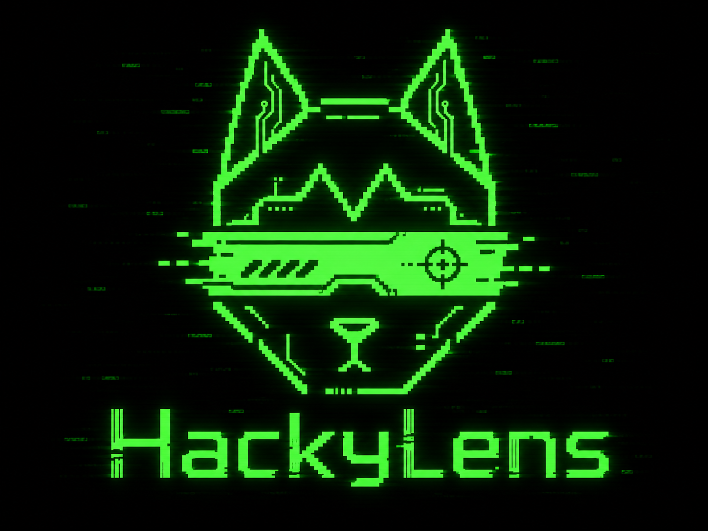
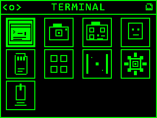
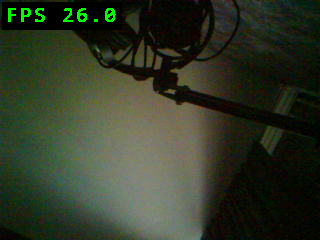

# HackyLens

<p align="center">
  
</p>

HackyLens is an open-source, modular firmware for the DFRobot HUSKYLENS camera. It targets the Kendryte K210 and provides a compact on-device environment for camera experiments, QR scanning, face detection, file browsing, diagnostics, and small interactive apps.

> [!WARNING]
> Flashing custom firmware replaces the firmware currently installed on the device. Make sure you are comfortable entering the K210 bootloader and restoring your preferred firmware before proceeding.

## Features

- Live OV2640 camera preview with configurable capture and display settings
- QR scanning powered by [quirc](https://github.com/dlbeer/quirc)
- KPU-based face detection
- FAT32 SD-card support, photo capture, screenshots, and an image viewer
- On-device terminal with bounded history and scrolling
- Built-in file browser, button tester, Pong, settings, and sleep mode
- Compile-time app registry: omit individual apps from custom builds
- UART tooling for flashing, logs, commands, LCD screenshots, and raw camera frames
- Layered C codebase with an automated architecture-boundary check

## Screenshots

| Main menu | Live camera |
| --- | --- |
|  |  |

These 320 x 240 images were captured directly from a running HUSKYLENS over the firmware's UART screenshot protocol.

## Included apps

`TERMINAL`, `CAMERA`, `QR-CAMERA`, `FACE DETECT`, `FILES`, `BUTTONS`, `PONG`, `SETTINGS`, and `SLEEP`

## Build

The bootstrap script currently provisions the Windows Kendryte toolchain. Run the following commands from the repository root in PowerShell.

### Prerequisites

- Git
- Python 3
- CMake
- Ninja
- A MinGW-compatible build environment

Install the Python serial dependency:

```powershell
python -m pip install pyserial
```

Download the Kendryte SDK, toolchain, and flashing support files, then load the generated environment:

```powershell
python tools\bootstrap_deps.py
. .\env.ps1
python tools\check_env.py
```

Run the architecture check and build the full firmware:

```powershell
python tools\check_arch.py
python tools\build_firmware.py full
```

The firmware image is written to `build\hackylens.bin`. Packaged image metadata is written to `dist\`.

Apps can be excluded by repeating `--disable-app`:

```powershell
python tools\build_firmware.py full --disable-app pong --disable-app terminal
```

## Flash and debug

List detected serial adapters:

```powershell
python tools\hkflash.py list
```

Flash the image and monitor the boot log:

```powershell
python tools\hkflash.py flash-monitor build\hackylens.bin --port COM10
```

Capture the current LCD contents without a camera or screen-grabber:

```powershell
python tools\hkflash.py screenshot --port COM10 --output screen.bmp
```

Run `python tools\hkflash.py --help` or the help for an individual subcommand to see reset, baud-rate, verification, monitor, command, and frame-capture options.

## Project layout

| Path | Purpose |
| --- | --- |
| `firmware/src/apps` | App entry points and self-contained feature modules |
| `firmware/src/controllers` | User flows and screen coordination |
| `firmware/src/services` | Camera, QR, settings, debug, and screenshot services |
| `firmware/src/storage` | FAT32, files, images, photos, and persistent data |
| `firmware/src/ui` | Screen rendering |
| `firmware/src/drivers`, `board`, `hal` | Hardware-facing code |
| `firmware/src/runtime` | Startup and the main loop |
| `tools` | Dependency bootstrap, build, checks, flashing, and diagnostics |

More detail is available in [Architecture](docs/ARCHITECTURE.md), [Modules](docs/MODULES.md), [App lifecycle](docs/APP_LIFECYCLE.md), and [RAM/flash budget](docs/RAM_BUDGET.md).

## License

HackyLens is released under the [MIT License](LICENSE).
