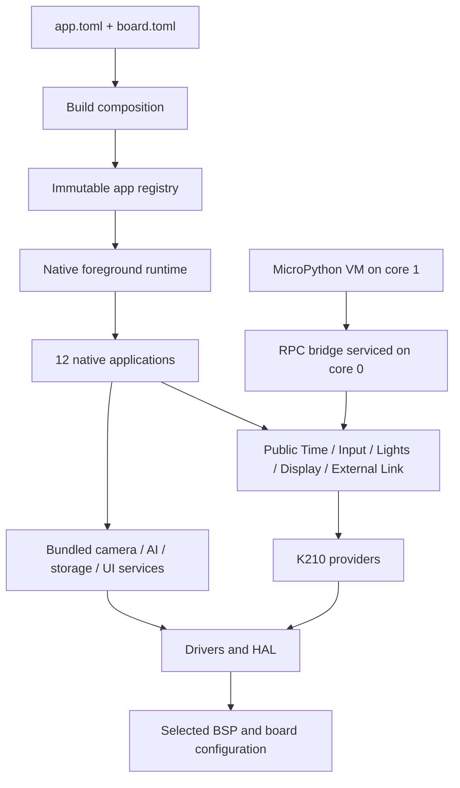

# Анализ прошивки HackyLens и соответствия архитектуре

Анализ начат 22 сентября, итоговая проверка завершена 23 сентября 2026 года. Репозиторий: `C:\Users\aztec\Projects\HUSKY-REVERSE\hackylens`.
Проанализирован HEAD `f3edcbda1b0b8002da245f9623c67021274e833d`, версия 0.4.0. В начале проверки отслеживаемые файлы не имели изменений.

## Вывод

**Прошивка соответствует основной структуре заявленной многослойной K210-архитектуры, но не всем её поведенческим контрактам.** У неё действительно есть единый native runtime, генерируемый неизменяемый реестр приложений, отдельные BSP/HAL, типизированные аппаратные сервисы, общие реализации для native-кода и MicroPython и управляемые времена жизни ресурсов. Это подтверждено чтением реализации, штатными тестами и двумя реальными сборками.

Вместе с тем зелёный архитектурный guard не означает полного соответствия. Обнаружены **девять замечаний**: две ошибки исключения camera-модулей из сборки, шесть проблем поведения/владения ресурсами и одна утечка платформенных деталей вверх по слоям. Для восьми первых замечаний получены воспроизведения на неизменённых production-исходниках: компиляционные либо host-проверки с подменой аппаратных/VM-зависимостей. Девятое подтверждается непосредственно исходным кодом.

Полный профиль SEN0305 и профиль без MicroPython собираются. Проблемы сокращённых camera-профилей не означают, что полная прошивка сейчас неработоспособна. Ошибки не исправлялись: результат этого задания — анализ, доказательства и порядок исправлений.

## Основание и границы анализа

Архитектурный эталон: [ARCHITECTURE.md](../../../docs/ARCHITECTURE.md), [APP_RUNTIME.md](../../../docs/spec/APP_RUNTIME.md), [APP_SDK.md](../../../docs/spec/APP_SDK.md), [контракты сервисов](../../../docs/spec/CAPABILITY_API.md), [таблица слоёв](../../../tools/architecture_layers.toml), [RAM_BUDGET.md](../../../docs/RAM_BUDGET.md).

Инвентаризация охватила 455 C/C++ source/header-файлов в корнях архитектурного guard: 65 947 строк, из них 23 897 строк ресурсов и 42 050 остальных строк. Это физические строки, включая комментарии и пустые строки, а не количество исполняемых строк. В 12 приложениях — 81 translation unit и 188 source/header-файлов. Сторонние библиотеки, Kendryte SDK, скрипты, TOML и тесты не входят в эту сумму; нужные для выводов части изучались отдельно. Автоматический проход выполнен по всему этому набору, ручной разбор сосредоточен на архитектурных границах и путях владения, исполнения и отказа. Построчная верификация всех библиотек не заявляется.

Проверены startup/main loop, runtime/switch/surface, композиция приложений, типизированные сервисы, native/MP-переходы, camera/frame pool, KPU/core1, хранение настроек и userfs, UART/HMPY, CI и фактическая раскладка памяти. Отдельного инструментального line/branch coverage не снималось.

Аппаратные действия в этой сессии не выполнялись: COM-порт не открывался, устройство не перепрошивалось, flash/SD устройства не изменялись. Историческая аппаратная приёмка из документации остаётся исторической; новые дефекты ниже проверены на host либо статически. Полная локальная сборка обновила генерируемые build/dist-артефакты и совпала с принятым raw-образом по хешу.

## Проверки и воспроизводимость

| Проверка | Результат этой сессии |
|---|---|
| `check_docs.py` | PASS |
| `check_app_sdk.py`, включая standalone CMake/Make fixture | PASS |
| `gen_app_composition.py --check` | PASS |
| `check_app_composition.py` | PASS |
| `check_arch.py` | PASS, 12 feature-модулей |
| `check_capabilities.py` | PASS |
| `check_board_ports.py --all` | PASS, два descriptor |
| `check_board_ports.py --board sipeed-maix-cube --compile` | PASS, host compile/link BSP; это не запуск Cube |
| `check_env.py` | PASS |
| `run_tests.py` | **218 тестов, 71,026 с, OK, без пропущенных тестов** |
| Полная cross-сборка SEN0305 без MicroPython | PASS, raw 1 353 528 байт |
| Полная cross-сборка SEN0305 | PASS, raw 1 545 272 байта |
| Object/dependency architecture checks двух профилей | PASS; хеши provider-объектов совпадают между профилями |
| Symbol checks / composition checks обеих сборок | PASS |
| `check_resources.py` | PASS |

Строки `[SKIP] disabled app source` в логах означают ожидаемое исключение файлов тестовой композиции, а не пропущенные unittest. В cross-сборке есть предупреждения unused variable/function из SDK/стороннего AprilTag-кода; ошибок сборки полного профиля нет.

Полный raw SHA-256:

```text
811be8cdc6ea18b66fa1d657e1c3850de568ae1e58c76a8408b1306e22bbf18b
```

Он совпадает с принятым firmware `8527aab`, указанным в текущем ARCHITECTURE.md. Это подтверждает воспроизводимость байтов образа, но не опровергает обнаруженные недостатки его реализации.

Логи текущей сессии находятся в `build/audit-2026-09-22`. Снимки, сохраняемые с отчётом: [inventory.json](../../../docs/audits/2026-09-22/inventory.json), [probe-results.json](../../../docs/audits/2026-09-22/probe-results.json). В inventory подсчитаны разрешённые checker-ом include-ссылки; это не полный граф вызовов или всех linker-зависимостей.

Дополнительные проверки воспроизводятся из корня репозитория:

```powershell
. .\env.ps1
python docs\audits\2026-09-22\probe_contracts.py
```

[probe_contracts.py](../../../docs/audits/2026-09-22/probe_contracts.py) компилирует production-файлы без изменения их логики. HAL, executor, VM и часть UI-провайдеров заменяются заглушками. Скрипт выводит наблюдения, а не является regression suite, где наличие каждого дефекта обязано завершать процесс ненулевым кодом. Он также проверяет компиляцию выбранных translation units после настоящего `stage_firmware_sources`; отдельные полные cross-сборки этих двух отрицательных профилей не выполнялись.

## Фактическая архитектура



Здесь принципиальны две разные границы. Public SDK уже относительно узок, а bundled-приложения используют также firmware-private services, storage и UI. Поэтому одинаковая lifecycle-сигнатура всех 12 приложений ещё не делает все 12 переносимыми standalone SDK-приложениями. Текущая документация это в целом признаёт.

| Область | Оценка | Подтверждение / ограничение |
|---|---|---|
| Один native lifecycle | Соответствует | `start/event/render/stop`, один foreground switch, отдельный close-event |
| Неизменяемые идентификаторы/registry | Соответствует | Manifest-generated const descriptors, autostart не зависит от меню |
| Изоляция private app headers | Соответствует проверяемым правилам | Source и object guards прошли |
| Исключение приложений из сборки | Частично | Full/no-MP работают; camera-профили ломаются, F01/F02 |
| Общая реализация typed services для C/Python | Соответствует на уровне provider | Provider-объекты совпадают; передача владения native SDK не завершена, F03 |
| Native teardown | В основном соответствует | Общий абсолютный deadline, попытка retire всех сессий, инвалидирование; существующие тесты проходят |
| MicroPython run lifetime | Частично | Обычно отделён от жизни экрана; неудачный RUN меняет состояние существующего запуска, F05/F06 |
| Display render transaction | Частично | Runtime открывает/presents/aborts; смешанный batch/surface-путь нарушает контракт, F08 |
| Stale-token isolation | Частично | Контексты, wakeup, workspace и External Link имеют защиту; camera lease сбрасывается, F07 |
| Board/platform separation | Частично | BSP/HAL выделены; memory-map logic осталась в app/adapter, F09 |
| Статический RAM/flash budget | Подтверждён для full | Реальные ELF-измерения и guard; не доказательство peak heap/stack |
| Межплатформенная переносимость | Не доказана | Один физически принятый K210 порт; Cube — compile conformance |

## Замечания

Приоритет P1 означает, что нужно восстановить заявленный путь сборки в ближайшем исправлении. P2 — значимый дефект поведения или архитектурного контракта. Для скрытых дефектов отдельно указана достижимость: они не выдаются за уже наблюдённый сбой устройства.

| ID | Приоритет | Замечание | Проверка |
|---|---|---|---|
| F01 | P1 | QR не декларирует camera, поэтому QR-only camera-профиль теряет camera-исходники | Staging + compile FAIL |
| F02 | P1 | Runtime требует camera-light даже при исключении всех камер | Staging + compile FAIL |
| F03 | P2 | Native SDK не получает Lights у постоянного settings-владельца | Production runtime + production Lights/settings, BUSY |
| F04 | P2 | UART service теряет хвост уже прочитанного блока после первого пакета | Два PING: 20 bytes, только один ответ |
| F05 | P2 | Отказ второго RUN портит exit reason первого | Нормальное завершение превращается в STOPPED/BUSY |
| F06 | P2 | Невалидный внутренний RUN создаёт ложный terminal handoff | Cleanup до исполнения worker |
| F07 | P2 | Старый camera lease освобождает кадр новой сессии | Lease 1 повторяется после restart |
| F08 | P2 | Surface lock после рисования молча уничтожает batch | clear=OK, lock=OK, abort=1 |
| F09 | P2 | K210 address mapping реализован внутри app/adapter | Прямое чтение исходников |

### F01. QR отсутствует в наборе camera-потребителей сборщика

В [QR manifest, строка 5](../../../firmware/src/apps/qr_camera/app.toml) указаны только `display`, `time`, `input`. Между тем [build_firmware.py:85](../../../tools/build_firmware.py) получает `CAMERA_APP_IDS` именно из `requires = camera`. При исключении CAMERA, FACE, APRILTAG и OBJECT QR остаётся включённым, но [staging:494](../../../tools/build_firmware.py) считает camera feature ненужной и удаляет shared camera-файлы.

Воспроизведена композиция, соответствующая:

```powershell
python tools\build_firmware.py full --board huskylens-sen0305 `
  --disable-app camera --disable-app face-detect `
  --disable-app apriltag --disable-app object-detect
```

После production staging компиляция QR entry падает: `../../services/camera_light.h: No such file or directory`. Macro `HK_ENABLE_CAMERA_FEATURE` в генерации конфигурации QR при этом учитывает: получаются два противоречащих друг другу определения состава camera feature.

Влияние: документированная независимая компоновка приложений нарушена; full/no-MP CI это не обнаруживает. Исправление: объявить camera-зависимость QR в manifest и проверять хотя бы одну композицию, в которой QR — единственный потребитель камеры.

### F02. No-camera профиль всё равно зависит от удаляемого camera-light

[app_runtime_integration.c:10](../../../firmware/src/runtime/app_runtime_integration.c) безусловно включает `services/camera_light.h`, а [cleanup:45](../../../firmware/src/runtime/app_runtime_integration.c) вызывает `camera_light_retire`. Этот header и implementation входят в исключаемый набор `CAMERA_FEATURE_SOURCE_MODULES`.

Если дополнительно исключить QR, production staging удаляет все camera-services, после чего компиляция самого runtime падает: `../services/camera_light.h: No such file or directory`. Это отдельная причина: добавление camera в QR manifest F02 не исправляет.

Исправление: условная интеграция camera cleanup с корректным пустым вариантом, когда camera feature отсутствует, либо отдельная явно выбранная реализация cleanup. Проверять compile/link хотя бы минимальной композиции без всех пяти camera-приложений. Не удерживать весь camera stack только ради одного fallback cleanup.

### F03. Передача владения Lights доступна внутренним потребителям, но отсутствует для native SDK

При startup вызываются `screen_brightness_apply`, `illum_led_apply`, `rgb_led_apply`. [settings_lights_apply.c:19](../../../firmware/src/services/settings_lights_apply.c) открывает постоянные сессии всех трёх каналов; выключенный LED тоже остаётся занятым. [hk_app_context_lights:519](../../../firmware/src/app_runtime/runtime.c) сразу вызывает `hk_lights_open`, без передачи владения от settings.

В отдельной проверке воспроизведён штатный startup Lights, затем приложение запущено через production integration. Его SDK-запрос ILLUMINATION получает `HK_ERR_BUSY (-6)`. После firmware-private `settings_lights_suspend` тот же запрос получает `HK_OK`.

MicroPython решает этот конфликт через [binding_claim_light:169](../../../firmware/src/adapters/micropython/micropython_capability_bridge.c), а CAMERA — через собственный service. Поэтому равенство providers пока не означает равенства доступных сценариев native/Python. Сам механизм исключительного владения работает правильно; отсутствует продуктовая политика передачи временного владения для SDK.

Аналогичный пробел виден статически для External Link: штатный service держит connector, native accessor открывает его напрямую, а MP bridge предварительно вызывает `external_link_service_suspend`. Этот второй случай не выделен как отдельно воспроизведённый runtime-дефект.

Исправление: выразить передачу/восстановление временного владения над provider, в production integration/service policy. SDK-приложению не должны требоваться private settings/link headers для штатной работы. Добавить интеграционный тест запуска native-приложения после настоящего startup, а не только тест на изначально свободном fake provider.

### F04. Несколько UART-пакетов в одном чтении приводят к потере запроса

[external_link_service.c:342](../../../firmware/src/services/external_link_service.c) извлекает до 32 байт в локальный массив. После первого распознанного кадра [цикл:350](../../../firmware/src/services/external_link_service.c) делает `break`. Оставшиеся байты этого массива уже удалены из provider RX/FIFO и нигде не сохраняются. Комментарий о сохранении следующего кадра в hardware FIFO не соответствует произошедшему чтению.

Production service/protocol + штатная host transport fixture:

```text
последовательные два PING: bytes=20 rx=2 tx=2 bad=0
те же два PING одним RX:  bytes=20 rx=1 tx=1 bad=0
```

Потеря тихая. Документированный UART — поток байтов; ограничение «строго один outstanding request» в контракте не установлено. Затрагиваются также конец первого и начало следующего пакета в одном блоке, например при повторах запроса клиентом.

Исправление: хранить непрочитанный хвост в bounded RX staging/cursor до завершения ответа либо организовать чтение без извлечения лишних байтов. Нужны проверки coalesced frames и пакетов, разбитых по произвольным границам чтения.

### F05. Повторный RUN меняет исход уже запущенного Python-кода

При активном запуске [micropython_runtime.c:183](../../../firmware/src/services/micropython_runtime.c) возвращает отказ, но перед этим пишет `MICROPYTHON_EXIT_BUSY` в `shared->exit_reason` текущего запуска. [Worker completion:157](../../../firmware/src/services/micropython_runtime.c) ставит COMPLETE только если поле ещё NONE. В результате успешный старый скрипт заканчивается как STOPPED/BUSY. Exception-путь также не заменяет уже ненулевую причину.

Проверка production runtime с исполняющимся по запросу fake executor и VM-заглушкой:

```text
normal: final_state=4 (FINISHED), exit_reason=1 (COMPLETE)
busy:   second RUN rejected, final_state=0 (STOPPED), exit_reason=5 (BUSY)
```

Достижимо через второй корректный HMPY RUN во время первого: [micropython_program.c:61](../../../firmware/src/services/micropython_program.c) вызывает этот runtime. Сам BUSY-ответ второму запросу допустим; порча результата первого — нет.

Исправление: отделить результат попытки запуска от terminal outcome принятого run. Отказ RUN не должен менять состояние/diagnostics активного run. Проверять RUN→RUN(BUSY)→normal finish и RUN→RUN(BUSY)→exception.

### F06. Невалидный внутренний RUN может вызвать cleanup до завершения worker

Проверка аргументов [micropython_runtime.c:177](../../../firmware/src/services/micropython_runtime.c) выполняется до busy-check и пишет `state=ERROR`. [micropython_runtime_poll:277](../../../firmware/src/services/micropython_runtime.c) трактует любой неактивный state как terminal worker handoff, даже если executor ещё не закончил. Если во время активного запуска вызвать `micropython_runtime_start("", 0, ...)`, следующий poll очищает bridge преждевременно.

В probe новый запрос отклонён, но зарегистрирован `cleanup_while_executor_busy=1`; worker на этот момент ещё даже не исполнялся. Для реально работающего worker это нарушение времени жизни принадлежащих ему Display/Lights/External Link.

**Достижимость ограничена:** текущий `micropython_program_run_file` отвергает пустые/слишком большие файлы до runtime, а debug-примеры содержат валидные константы. Не установлено, что этот дефект сейчас вызывается обычной некорректной HMPY-командой. Это подтверждённая ошибка внутренней границы сервиса и риск для новых callers, а не заявленная удалённая уязвимость.

Исправление: отказ не должен публиковать terminal state другого run. Worker terminal handoff должен происходить из контролируемого пути завершения; особенно важно тестировать ошибки API при живом executor.

### F07. Camera lease ID повторяется после рестарта

[camera_stream_start:132](../../../firmware/src/drivers/camera_stream.c) обнуляет `g_next_lease_id`. Следующий acquire снова выдаёт 1. [camera_stream_release:241](../../../firmware/src/drivers/camera_stream.c) проверяет только числовой lease ID, без session epoch.

Probe выполняет start→capture→acquire(old)→stop→start→capture→acquire(new)→release(old). Результат:

```text
old_lease=1 current_lease=1
new slot state: LEASED (3) -> FREE (0) после stale release
```

Новая DVP-запись после такого освобождения сможет использовать кадр, ещё принадлежащий новому reader. Этот дефект относится к гарантии защиты от stale borrows. Текущие синхронные callers стараются отпускать кадры до stop; наблюдённый аппаратный сбой из обычного UI этим аудитом не установлен. Важно не смешивать эту проблему с `frame_workspace`: его поколения отдельно защищены и существующие проверки проходят.

Исправление: монотонный lease generation через рестарты либо session epoch в borrow-token; запрет повторного использования при исчерпании, если контракт требует строгой stale-защиты. Добавить именно restart-boundary regression, а не только повторный release в одной сессии.

### F08. Командное рисование и surface lock не взаимоисключаются в обоих направлениях

APP_RUNTIME/APP_SDK требуют выбрать один режим на render pass. После surface lock команды действительно отвергаются. Но в обратном направлении [surface_lock:160](../../../firmware/src/runtime/app_runtime_integration.c) просто abort-ит уже открытый batch и возвращает direct surface. Наличие уже принятых draw-команд не учитывается.

Production integration в probe принимает `clear`, затем принимает `lock`; fake provider фиксирует один abort. Следовательно, успешно принятая команда была отброшена вместо `HK_ERR_INVALID_STATE` на смене режима. Возвращаемый затем fixture-ом `poll=-10` связан с тем, что его present моделирует batch-путь; он **не используется как доказательство ошибки аппаратного present**. Доказательство F08 — успешные clear/lock и уничтожение ранее принятого batch внутри production integration.

Исправление: учитывать выбор режима render pass; разрешать переход к direct surface только до первой draw-команды. Проверить обе последовательности и сохранение уже staged данных при отказе.

### F09. Платформенная карта памяти осталась в верхних слоях

[apriltag_detector.c:102](../../../firmware/src/apps/apriltag/apriltag_detector.c) внутри приложения преобразует диапазон `0x80000000..0x80600000` вычитанием `0x40000000`. Такая же логика находится в [MicroPython adapter:100](../../../firmware/src/adapters/micropython/micropython_capability_bridge.c), а также в common services `core1_executor`, `micropython_runtime`, `camera_ai_input` и camera driver.

Это конкретная зависимость feature/adapter-кода от memory map K210, хотя она не использует запрещённый SDK header или `hal_*` symbol. Include/object guard поэтому проходит. Текущее поведение на K210 само по себе этим не объявляется ошибочным, но переносимость feature logic ограничена не только board descriptor.

Исправление: вынести выбор shared-memory alias/доступа и правила публикации в небольшую platform/shared-buffer границу с host-реализацией. Feature-код должен описывать содержимое, lifetime и публикацию результата, а не SRAM-адреса. Не нужен новый общий broker: нужен перенос уже существующей аппаратной детали в нижний слой.

## Разбор подсистем

### Startup и выполнение native-приложений

Composition root мал; `firmware_startup` организует hardware/settings/menu/storage/autostart, `hk_main` обслуживает Input, debug/system tick и app switch. Native runtime действительно один. Он нормализует недопустимый lifecycle `HK_PENDING`, передаёт BACK как Input, отправляет Runtime Close перед обычным teardown и сохраняет первое диагностическое значение. Ошибка prepare/start/stop не отменяет последующую очистку.

Callback execution кооперативен. Измерение timer/render budget после возврата callback не способно остановить зависший C-код. В текущем manifest QR имеет cadence 20 мс и разрешённый timer callback до 3 с; другие media-приложения — до 1 с. Это не обещание 20-миллисекундной отзывчивости UI или верхней границы системного jitter. Startup и произвольные input callbacks не превращены в принудительно прерываемые задачи.

Render callbacks реально реализованы у BUTTONS, PONG, SETTINGS, SLEEP и TERMINAL. У остальных семи `render=NULL`: их представление обслуживают существующие firmware services/views. Такой режим разрешён текущим APP_RUNTIME, поэтому сам по себе не является нарушением. Но перенос на новый графический backend должен учитывать оба пути.

### Типизированные аппаратные сервисы

Time/Input имеют board lifetime. Lights/Display/External Link используют стабильную память session-объектов. Общие проверки отвергают копии/неправильного владельца там, где сравниваются claimant-адреса. External Link сохраняет generation операций через reopen. Cleanup направлен на logical retirement и локальный quarantine, а не глобальную остановку всего runtime.

Сильная сторона — normative fake/K210 тесты и одинаковые provider-объекты full/no-MP. Слабая — composition-level ownership между постоянными системными сессиями и новым native SDK caller; это F03. MicroPython bridge также намеренно использует private `display_stage_checkpoint/restore` для RPC rollback. Поэтому он пока не полностью заменяемый клиент только public Display ABI; это существующая явно помеченная private интеграция, а не найденная запрещённая include-зависимость.

### Camera, AI, QR и core1

Camera transport, capture/session и feature-specific обработка разделены. DVP/frame pool, camera→KPU planar input, общая KPU-модель и feature postprocess имеют разные владельцы. FACE/OBJECT не содержат отдельные аппаратные KPU реализации. OBJECT postprocess остаётся на core0; APRILTAG и MicroPython используют общий executor, а не заменяют entry point core1.

Модельные descriptor/CRC/output-size проверки и deferred unload полезны и действительно присутствуют. Вместе с тем безопасное shared-memory взаимодействие не доказывается memory barrier в host-тесте. В APRILTAG управляющие `volatile` globals и uncached image/result buffers организованы по-разному; согласованность при stress/restart на железе требует отдельного подтверждения. Это область дополнительной проверки, не утверждение о доказанной cache-ошибке.

Два конкретных недочёта здесь — F07 и размещение K210 address alias в app/adapter. QR decoder, кроме того, сохраняет heap-объект между входами: `qr_decoder_engine_reset_session` сбрасывает счётчики, а `quirc_destroy` из feature-кода не вызывается. Это bounded retained cache, не доказанная бесконечная утечка; его надо учитывать в максимальном heap при QR→OBJECT/APRILTAG переходах.

### MicroPython и HMPY

VM исполняется на общем core1 executor; аппаратные RPC обслуживаются на core0 через те же typed services. Worker run отделён от жизни native-экрана; есть deadlines, stop flag, stdout-ring, HMPY lease, ограниченный source/heap и watchdog recovery path. Userfs uploads не подменяют активный исполняемый source buffer.

Основной недочёт — смешение результата запроса запуска и состояния уже принятого run, F05/F06. Штатный suite содержит runtime source-shape assertions, но они не заменяют исполнение этих state transitions: новые probes обнаруживают ошибки, не нарушая проверяемые строки/порядок исходного текста.

WDT recovery, STOP из native iterator и физическая кнопка BACK не были повторно квалифицированы на устройстве. Если main loop сам надолго блокирован SD/GIF/прочим C-кодом, servicing RPC/watchdog со стороны core0 также может задерживаться. Существование watchdog-кода не равно доказанной верхней границе остановки во всех совместных сценариях.

### Storage, настройки и протоколы

Internal flash использует descriptor-backed partitions, range/alignment checks и runtime-writable flags. Userfs применяется поверх littlefs, имеет CRC, временные файлы, rename-based commit и явное форматирование. Settings отделяет payload codec, persistence и физический store; есть совместимость версий и стабильные autostart ID.

Screenshot codec не обращается прямо к LCD/UART: source, BMP encoder и stream разделены. External Link wire codec также отделён от транспорта и vision-results. F04 находится именно в интеграции streaming RX с асинхронным TX, не в CRC codec.

Новые доказательства power-loss атомарности NOR, износа, обработки всех повреждённых FAT32/image inputs и физической устойчивости UART/I2C не получены. Тесты и статический разбор дают ограниченную уверенность в этих областях; отчёт не является полной сертификацией всех decoders или security-аудитом внешних библиотек.

## Память и стоимость архитектуры

| Измерение full ELF/image | Байты |
|---|---:|
| ELF text | 1 386 944 |
| ELF data | 158 224 |
| ELF bss | 2 734 992 |
| Static RAM = data+bss | **2 893 216** |
| Raw image | **1 545 272** |
| Занято flash с упаковкой/выравниванием | 1 548 288 |
| Raw image без MicroPython | 1 353 528 |
| Разница raw image full/no-MP | 191 744 |

По link symbols: `_heap_start=0x804250c0`, `_heap_end=0x80600000`, исходная heap arena — **1 945 408 байт**. `_stack_size=0x8000`, то есть резервируются два стека по 32 768 байт. Размер heap arena — предел области до runtime allocations, не измерение свободного heap после boot и не гарантия отсутствия фрагментации.

Крупнейшие статические объекты из текущего ELF:

| Объект | Байты | Владелец |
|---|---:|---|
| `g_camera_slots` | 1 228 800 | Два frame slots, максимальный размер 640×480 RGB565 |
| `g_png_comp` | 524 288 | FILES PNG compressed buffer |
| `g_camera_ai_input` | 230 720 | Общий planar DVP/KPU input + guard |
| `s_shadow` | 153 600 | LCD shadow |
| `g_heap` | 131 072 | MicroPython heap, уже включён в static RAM |
| `g_shared_storage` | 69 696 | MicroPython source/output/control |
| `g_program_source` | 65 536 | Буфер чтения скрипта |
| `g_huff_lit_table` / `g_huff_dist_table` | по 65 536 | PNG inflate |
| `g_workspace` | 33 952 | OBJECT postprocess |
| `g_luma` | 19 200 | APRILTAG input |

Ресурсный guard подтверждает отсутствие роста относительно принятого baseline. Он не измеряет peak heap, реальный stack high-water или общую латентность. В частности, модель OBJECT и временные AprilTag/quirc allocations находятся вне static data+bss.

В [app_manifest.py:30](../../../tools/app_manifest.py) у всех приложений пока одинаковые placeholder `static_ram_bytes=1 048 576`, `stack_bytes=16 384`, `state_bytes=1 024`, `render_budget_us=500 000`. Первые два поля не являются измеренными индивидуальными затратами и не обеспечивают memory isolation. Большая часть state media-приложений остаётся в их static globals, вне очищаемого 1 KiB lifecycle slot. Это нужно явно учитывать при оценке зрелости SDK и ресурсов; складывать двенадцать manifest RAM-значений бессмысленно.

Практическое направление оптимизации — измерять peak heap/stack и переходы между тяжёлыми приложениями, затем пересматривать буферы FILES/камера под необходимые максимальные разрешения. Дополнительные registry/broker-абстракции сами по себе эту стоимость не уменьшат.

## Что именно не доказывают зелёные проверки

1. Include/symbol rules подтверждают заданные запреты, но не полноту manifest `requires` и не отсутствие аппаратной логики в числовых адресах.
2. Два CI-профиля проверяют full и no-MP. Из них не следует, что компилируются произвольные сочетания `--disable-app`.
3. Свободный fake provider не моделирует runtime сразу после boot, когда системные services уже владеют ресурсами.
4. Проверка текста `micropython_runtime.c` не обнаруживает повреждение run state неудачным API-вызовом.
5. Stale-protection workspace не распространяется автоматически на camera lease из другой реализации.
6. Host compile Cube подтверждает дескриптор/BSP, а не full runtime, периферию, электрические характеристики или MCU-portability.
7. Размер ELF и число тестов не являются измерениями худшего времени выполнения, peak RAM либо полноты test coverage.

## Рекомендуемый порядок работ

1. **Восстановить camera-композиции:** F01/F02; добавить compile/link для QR как единственной камеры и для no-camera. Эти проверки должны использовать тот же staging, что production build.
2. **Исправить state/lifetime ошибки:** F05/F06 и F07; превратить audit probes в короткие regression tests с ожидаемым правильным результатом.
3. **Исправить потоковый UART:** F04; проверить две/три склеенные посылки, split frames, retries и корректность ответов по sequence.
4. **Завершить native service handoff:** F03, включая восстановление settings/link после stop/error. После этого выполнить один реальный paired Python/native пример LED + external UART.
5. **Согласовать оба Display render режима:** F08; проверять запрет смены режима без потери принятых данных.
6. **Убрать аппаратные адреса из app/adapter:** F09 через небольшую platform shared-memory границу; затем подтвердить APRILTAG/MP-переходы на железе.
7. **Измерить характеристики:** QR→OBJECT→APRILTAG→MP, многократные stop/switch, heap/stack high-water, event latency и WDT fault-injection. Это необходимое следующее доказательство для продуктовой переносимости и bounded-lifetime заявлений.

Текущую архитектуру целесообразно развивать локальными исправлениями. Единый runtime, immutable composition и typed providers уже работают и проверяются. Переписывание их с нуля не требуется; наиболее полезны исправления на стыках composition, ownership и asynchronous lifetime, где данный аудит обнаружил расхождения.
